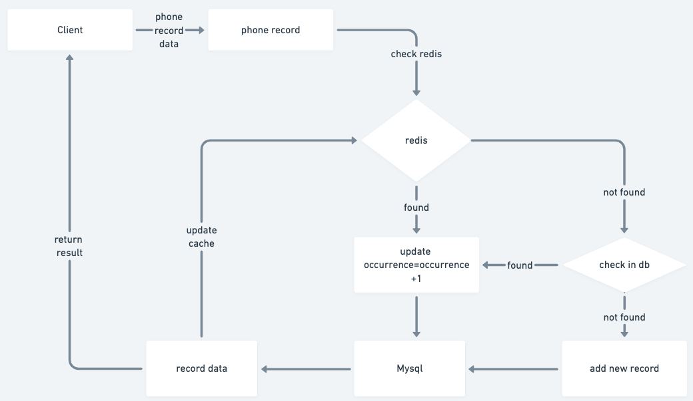

# Save Phone Record


## Run Locally

setup docker

in project folder ("/doordash") execute following command, bring up **Redis** and **Mysql**.

```shell
docker-compose up -d
```

setup database
- run **db.sql** in `doordash` database
- run **generate-test-data.sql** in `doordash` database will insert 1 million records
- run application

```shell
mvn spring-boot:run
```

## Workflow

- save phone record



Mysql persist phone records, redis to improve the performance.
Data consistency between mysql and redis is **eventual consistency**.
Update database before update redis, when redis write fail, will delay and try again.
